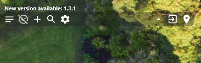

TasksWidget
===========

  

TasksWidget is a multiplatform application designed to help you manage your tasks efficiently. This lightweight, easy-to-use widget allows you to create, update, and organize tasks right from your desktop. The widget seamlessly integrates with your device's native operating system and offers a clean and intuitive user interface for effective task management.

Table of Contents
-----------------

* [Features](#features)
* [Installation](#installation)
    * [Desktop](#desktop)
* [Usage](#usage)
* [Contributing](#contributing)
* [License](#license)

Features
--------

* Multiplatform support: Works on Windows only for now.
* Minimalistic design: Clean, clutter-free interface for easy navigation.
* Task management: Create, update, and delete tasks with just a few clicks.
* Task prioritization: Organize tasks by priority levels to focus on what's most important.
* Task filtering: Filter tasks by status, priority, or custom tags for easy searching.
* Reminder notifications: Receive notifications for upcoming tasks or deadlines.
* Sync tasks across devices: Automatically sync tasks across all your devices using a secure cloud storage.
* Customizable appearance: Choose from a variety of themes and widget sizes to match your personal style.

Installation
------------

The app is currently only available on windows, the implementation in other platforms is still in progress.* 

### Desktop

#### Windows

1.  Download the latest release of TasksWidget from the [Releases](https://github.com/elfefe/TasksWidget/releases) page.
2.  Extract the downloaded archive to your desired location.
3.  Run the `TasksWidget.msi` executable file to start the application.

Usage
-----

> *You’ll find the instructions here to help you understand how to use the app.*

*Default TasksWidget*

To create a new task click on the .svg) icon.

*New task added*

The date will be **red** if it’s due for today, **yellow** if the date is passed, and **black** for a later due date.

The blank space at the right of the date is a text field to input the task title.

The white space below the task title is a text field to input the task description.

*Task with a description and a title*

The icon on the right indicates if the task is done () or not ().

If this icon is clicked the task will be removed from the active tasks. Clicking on the  icon will show the history of all the tasks.

If you want to hide all the descriptions to see more tasks, click the  icon.

To search through your tasks click the  icon.

*Reduced app*

The  icon reduces TasksWidget to a less invasive format.

The  icon hides TasksWidget in the system trail bar.

The  icon allows you to move the app horizontally across the window.

*App in system trail*

Click on the app icon in the system trail bar to show it back or right click and exit to stop the app.

By clicking the  icon and go to the *General* tab, you can __add the app to the startup programs__.

Contributing
------------

We welcome contributions from the community! If you'd like to help improve TasksWidget, please follow these steps:

1.  Fork the repository on GitHub.
2.  Create a new branch for your changes.
3.  Commit your changes to the new branch.
4.  Submit a pull request with a description of your changes.

Please read [CONTRIBUTING.md](CONTRIBUTING.md) for more information on how to contribute to the project.

License
-------

TasksWidget is released under the MIT License. See [LICENSE.md](LICENSE.md) for more information.