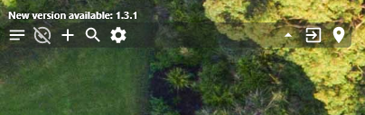

TasksWidget
===========

[](https://github.com/elfefe/TasksWidget/actions/workflows/ci.yml) [](https://opensource.org/licenses/MIT) 

TasksWidget est un **widget de tâches pour le bureau Windows** : une fenêtre
fine et discrète, posée sur le bord de l'écran, pour noter et suivre ses tâches
sans quitter ce qu'on fait. Interface minimaliste, descriptions en Markdown,
échéances colorées selon l'urgence.

Plateformes
-----------

L'application est écrite avec **Compose Multiplatform**, mais **seule la cible
Windows est active et testée aujourd'hui**. Les cibles macOS (`.dmg`) et Linux
(`.deb`) sont déclarées dans la configuration de packaging mais n'ont jamais été
produites ni vérifiées — les considérer comme non supportées en l'état.

> Note d'historique : une cible Android a existé puis a été retirée. Il n'y a
> **pas** de code natif C/C++ dans ce projet — ce que d'anciens scans prenaient
> pour du code natif était le toolset WiX (fabrication de l'installeur), qui a
> depuis été sorti du dépôt.

Fonctionnalités
---------------

* Widget de bureau discret, sans bordure, ancré sur le côté de l'écran.
* Création, édition et suppression de tâches en quelques clics.
* **Descriptions en Markdown** : titres, gras, italique, barré, code inline et
  blocs, surlignage, listes à puces et numérotées, liens et filets. Les symboles
  s'effacent à l'affichage, le texte reste du Markdown standard.
* Échéances datées : la date est **rouge** si la tâche est due aujourd'hui,
  **jaune** si elle est dépassée, **noire** pour plus tard.
* Historique des tâches terminées.
* Masquage des descriptions pour voir plus de tâches, recherche, format réduit.
* Réduction dans la barre système, et ajout au démarrage de Windows depuis les
  réglages.
* **Poignée déplaçable** : en maintenant **Ctrl** (touche modifiable), la pile ne
  se déploie plus à l'approche de la souris et la poignée se saisit — glissez-la
  le long du bord, ou vers l'autre côté de l'écran pour y basculer toute la pile.
  Sa place est retenue.
* **Aide intégrée** : le point d'interrogation de la barre de navigation ouvre un
  mode d'emploi.
* **Thème personnalisable** : couleurs de la barre, des icônes, du fond et du
  texte des tâches, avec retour aux couleurs d'origine en un clic.

### Sessions Claude Code

Les sessions Claude Code ouvertes sur la machine apparaissent d'elles-mêmes en
tête de la pile, une carte chacune — nom de la session, état, bouton d'édition,
rien de plus :

* **Suivi** : l'état (en cours / en attente / prête) est lu directement auprès du
  CLI. Survoler l'icône d'état montre les dernières réponses en infobulle ; la
  cliquer ouvre une fenêtre dédiée avec le fil complet. Les réponses sont
  **rendues** — titres, listes, blocs de code et liens cliquables — et non
  affichées en balisage brut.
* **Envoi** : le bouton d'édition déplie l'éditeur Markdown habituel, et le
  message part dans la **vraie session du terminal**. Le texte est déposé dans la
  console de la session comme un collage, ce qui préserve le Markdown multiligne.
* **Création** : le menu « + » ouvre une nouvelle session en contrôle à distance
  (`--remote-control`), pilotable depuis le widget comme depuis l'application
  Claude.

> Windows uniquement : l'envoi s'appuie sur la console de la session
> (`AttachConsole` / `WriteConsoleInput`). Claude Code prévoit un canal local
> dans le format de ses fichiers de session, mais ne le renseigne pas encore.

> La synchronisation cloud entre appareils, mentionnée dans d'anciennes
> versions, est **actuellement désactivée** : elle demandait des identifiants
> OAuth qui ne peuvent pas vivre dans un dépôt public. L'application fonctionne
> pleinement en local sans elle.

Installation
------------

Application disponible pour **Windows** uniquement.

1. Télécharger la dernière version depuis la page [Releases](https://github.com/elfefe/TasksWidget/releases).
2. Lancer `TasksWidget-<version>.msi` pour installer l'application.

Compilation
-----------

Prérequis : **JDK 17**. Le wrapper Gradle s'occupe de Gradle.

```bash
# Lancer l'application
gradlew.bat :desktop:run

# Lancer les tests
gradlew.bat :common:desktopTest

# Produire l'installeur MSI (Windows, nécessite le WiX Toolset sur le PATH)
gradlew.bat :desktop:packageMsi
```

> Sur ce dépôt, l'invocation `./gradlew` depuis Git Bash échoue sur un argument
> vide ; utiliser `gradlew.bat`.

Le **WiX Toolset** (nécessaire pour l'installeur MSI) n'est **pas** versionné :
le télécharger depuis [wixtoolset.org](https://wixtoolset.org/) (version 3.11) et
ajouter son dossier `bin` au PATH.

Usage
-----



*TasksWidget par défaut*

Pour créer une tâche, cliquer sur l'icône .


*Nouvelle tâche*

La date est **rouge** si la tâche est due aujourd'hui, **jaune** si elle est
dépassée, **noire** pour plus tard. L'espace à droite de la date est le champ du
titre ; l'espace en dessous, celui de la description.


*Tâche avec titre et description*

L'icône de droite indique si la tâche est faite
() ou non
(). Un clic
la retire des tâches actives ; l'icône

affiche l'historique.

L'icône 
masque les descriptions,
 ouvre la
recherche.


*Application réduite*


réduit la fenêtre à un format moins envahissant,
 la cache
dans la barre système, et

permet de la déplacer horizontalement.


*Application dans la barre système*

Depuis les réglages (icône
,
onglet *General*), on peut **ajouter l'application au démarrage de Windows**.

Structure du projet
-------------------

| Module | Rôle |
|---|---|
| `common` | tout le code : modèle de tâches, rendu Markdown, interface Compose, persistance |
| `desktop` | point d'entrée et packaging de l'application de bureau |

`DIAGNOSTIC.md` consigne l'état du projet établi lors de sa remise au propre.

Contribution
------------

Les contributions sont bienvenues : forkez le dépôt, créez une branche,
committez vos changements et ouvrez une pull request en décrivant vos
modifications.

Licence
-------

Publié sous licence MIT — voir [License.md](License.md).
